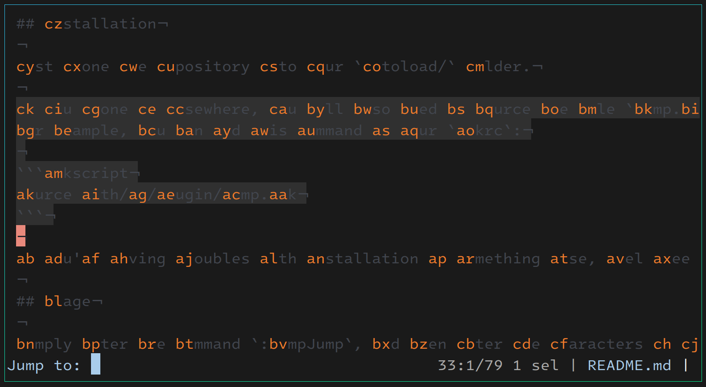

# Jump — another Kakoune jump-mode plugin



## Differences from existing alternatives

- Dimmed text when entering jump mode (face used is configurable)
- Highlighted labels (face used is configurable)
- Jumps in both directions with single command
- The label to be applied is calculated based on the distance from the cursor. That is, if you have
labels like `aa`…`bz`, then the ones closest to your cursor will be `aa`, `ab`, `ac`, and so on, whereas
the ones furthest from your cursor will be `bx`, `by`, `bz`, irrespective of whether the label comes before
or after the cursor line and column.
- Powered by Node

## Dependencies

You should have [node](https://github.com/nodejs/node) installed and available in your PATH.

## Installation

1. Either:
  - Clone the repository
  - Download just the files `index.js` and `jump.kak`.
    You can put them anywhere you want as long as they happen to be in the same directory and `index.js` is called `index.js`.

2. Source the file `jump.kak` in your `kakrc`.

## Usage

Simply enter the command `:jumpJump`, and then enter the characters of the label you want to jump to.

You can add the following mapping to your `kakrc`:

```kakscript
map global normal <ret> :jumpJump<ret>
```

## Configuration

The following options are exposed:

1. **jumpLabelsCharacters**
Characters to be used in labels. Must be at least 10 characters long.
Default value: "abcdefghijklmnopqrstuvwxyz".

2. **jumpExtraWordCharacters**
Additional characters, aside from alphanumerics, to consider as part of contiguous words for generating labels.
Default value: "_-".

3. **jumpLabelFace**
Face to use for highlighting jump labels.
Default value: PrimarySelection

4. **jumpDimFace**
Face to use for dimming out non-label text.
Default value: comment

## TODO
- Different faces for the first and following characters of a label.
- Incrementally remove highlighting when entering the characters for the label to jump to. That is, if `c` is entered
as the first character, every non-`c` label should be removed from the view, and every first `c` within every label
which starts with `c` should be highlighted differently.
- Allow labels of any length. Currently the only possible length of a label is two characters.
